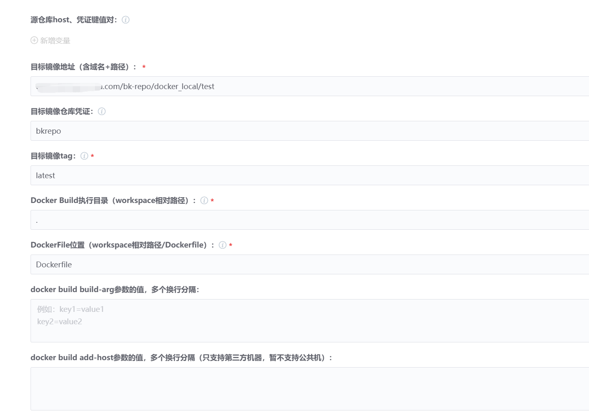

# docker build push

# 编译配置
 - JDK 1.8

# 插件使用示例

- 源仓库host、凭证键值对：如果Dockerfile中的基础镜像拉取需要凭证，可以填写此项。key是基础镜像仓库地址host，value是蓝盾凭证
- 目标镜像地址：完整的镜像推送地址
- 目标镜像仓库凭证： 蓝盾凭证，类型为包含用户名密码的凭证
- 目标镜像tag： 需要符合规范，大小写字母，数字，下划线，不能用中划线，不超过127个字符
- Docker Build执行目录： 插件执行docker build命令的所在目录
- DockerFile位置： DockerFile文件相对工作空间的相对路径
- docker build build-arg参数的值：按需填写
- docker build add-host参数的值：按需填写

  

